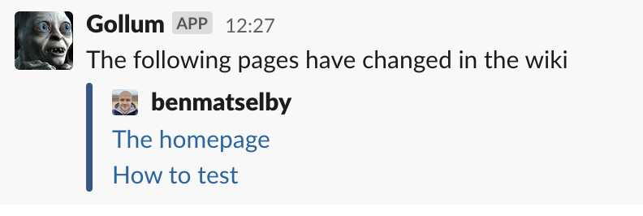

# Gollum Page Watcher GitHub Action

<a href="https://github.com/benmatselby/gollum-page-watcher-action/actions"></a> [](https://goreportcard.com/report/github.com/benmatselby/gollum-page-watcher-action)

A GitHub Action to watch for GitHub Wiki Page changes, and then notify a Slack channel

## Secrets

- `SLACK_WEBHOOK`: The Slack Webhook URL required to post a message to your workspace.

## Environment Variables

- `SLACK_USERNAME`: The Slack username if you want to define it, otherwise it will be what you have defined in Slack.
- `SLACK_CHANNEL`: The Slack channel if you want to define it, otherwise it will be what you have defined in Slack.

## Example

```shell
...
- name: Wiki Watcher
  uses: benmatselby/gollum-page-watcher-action@v1
  env:
    SLACK_WEBHOOK: ${{ secrets.SLACK_WEBHOOK }}
    SLACK_CHANNEL: #random
    SLACK_USERNAME: Gollum
...
```

This will result in



## Testing

To test this, you can run it from your command line with the following setup

```shell
GITHUB_EVENT_PATH=example-payloads/valid-payload.json \
GITHUB_EVENT_NAME=gollum \
SLACK_WEBHOOK=[your-slack-webook-url] \
SLACK_CHANNEL=[your-slack-channel] \
DEBUG=true \
go run main.go
```

If `DEBUG` is defined, it will not post to Slack, but rather output the webhook message in your terminal.


