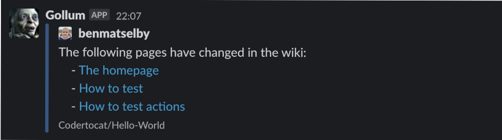

# Gollum Page Watcher GitHub Action

<a href="https://github.com/benmatselby/gollum-page-watcher-action/actions"></a> [](https://goreportcard.com/report/github.com/benmatselby/gollum-page-watcher-action)

A GitHub Action to watch for GitHub Wiki Page changes, and then notify a Slack channel

## Secrets

You can provide one of these methods to authenticate yourself.

- `SLACK_WEBHOOK`: The Slack Webhook URL required to post a message to your workspace.
- `SLACK_TOKEN`: A Slack token that will auth you into the Slack system.

## Environment Variables

- `SLACK_USERNAME`: The Slack username if you want to define it, otherwise it will be what you have defined in Slack.
- `SLACK_CHANNEL`: The Slack channel if you want to define it, otherwise it will be what you have defined in Slack.
- `PAGES_TO_WATCH`: A regex of page titles you want to watch, in order to get a notification. If not defined, all pages are watched.

## Example

```shell
...
- name: Wiki Watcher
  uses: benmatselby/gollum-page-watcher-action@v1
  env:
    SLACK_WEBHOOK: ${{ secrets.SLACK_WEBHOOK }}
    SLACK_CHANNEL: #random
    SLACK_USERNAME: Gollum
    PAGES_TO_WATCH: (^Home$)|(^Meeting minutes)
...
```

This will result in a match on "Home", and all pages with a title starting with "Meeting minutes".



## Testing

To test this, you can run it from your command line with the following setup

```shell
GITHUB_EVENT_PATH=example-payloads/valid-payload.json \
GITHUB_EVENT_NAME=gollum \
SLACK_WEBHOOK=[your-slack-webhook-url] \
SLACK_CHANNEL=[your-slack-channel] \
DEBUG=true \
go run main.go
```

If `DEBUG` is defined, it will not post to Slack, but rather output the webhook message in your terminal.


